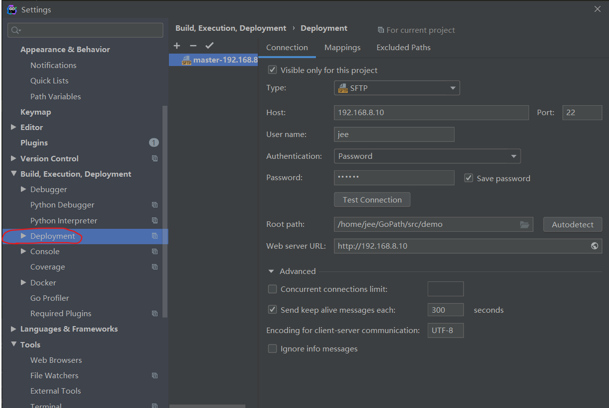
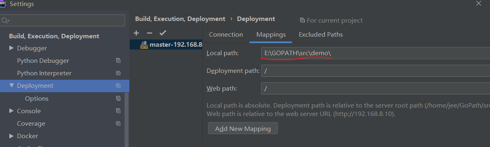
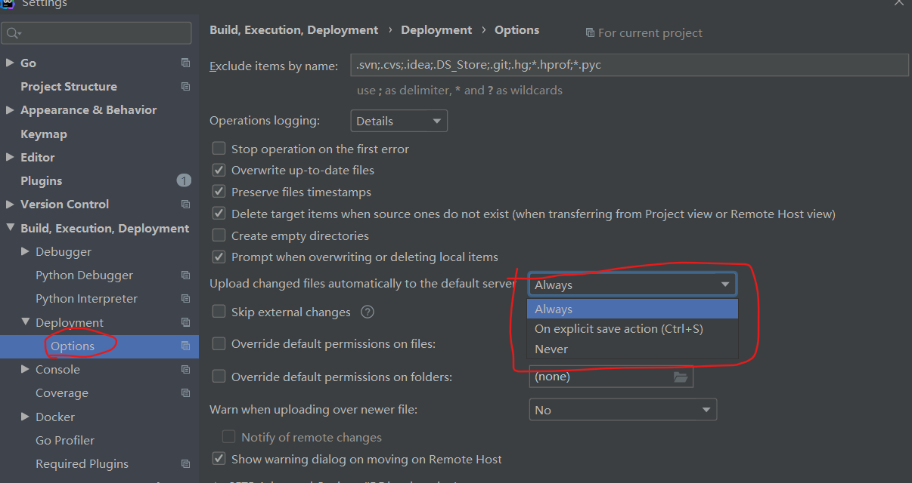
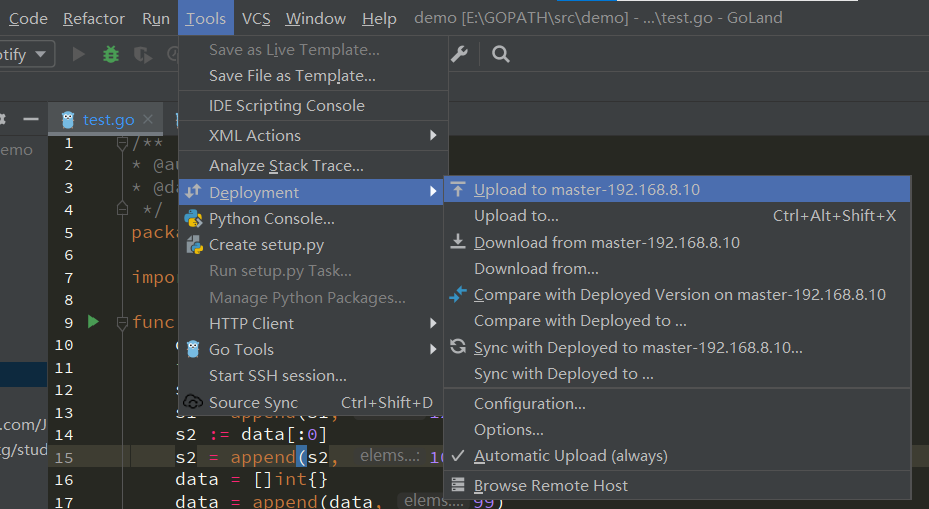
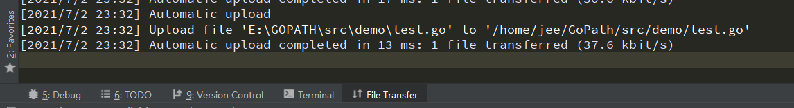
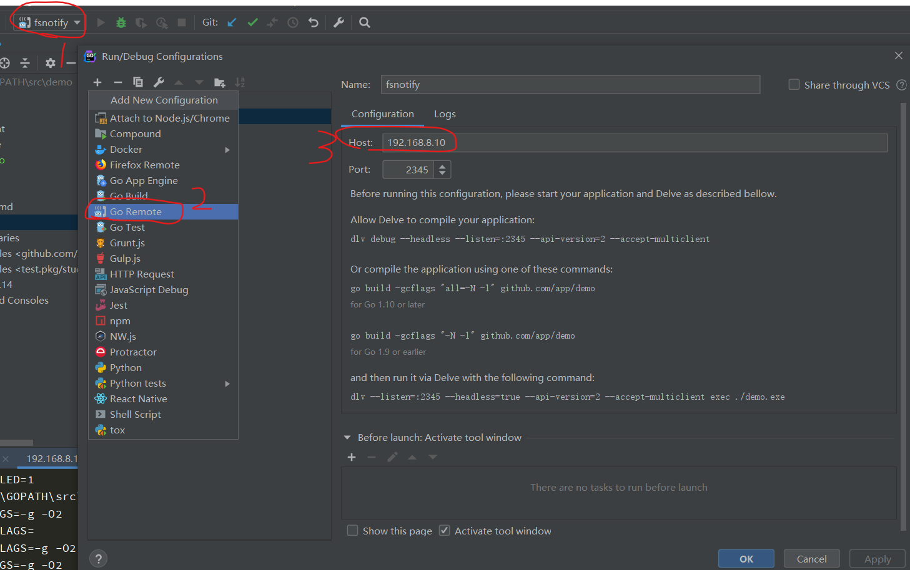
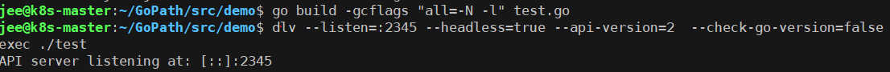
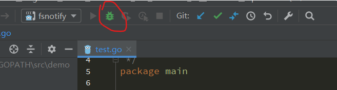
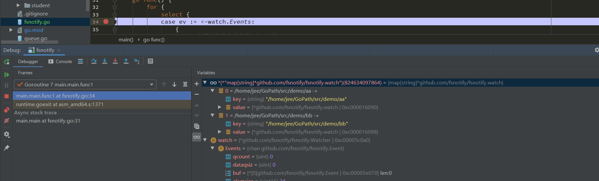

# **GoLand&Delev远程调试**

#### 本文环境配置
- 服务端 Ubuntu 16.04.7 LTS
- 客户端 Win10
- Goland 2019.3.2
- Golang 1.16.5
- Delev 1.4.0
#### 配置远程服务器
打开GoLand设置Deployment，配置远程服务器地址以及项目代码在服务器上的存放路径。其中Type选择`SFTP`，Root path即本地代码同步到远程服务器上的路径。



然后在Mappings中设置本地代码的路径，同步代码时即从该路径同步至刚才在服务器上配置的路径。



服务器地址和路径都配置好后，可以在Options中设置代码同步策略，一般选择Always自动同步。



然后，我们就可以把本地代码上传至服务器



首次上传后，后续我们每次修改代码后都会自动同步至服务器



#### 配置Delev远程调试
Delev项目地址 https://github.com/derekparker/delve ，安装Delev[参考博客](https://www.codercto.com/a/47853.html)

PS：国内拉取部分源码可能会失败，可以如下配置GOPROXY为阿里云代理，永久生效：

```shell
echo "export GOPROXY=https://mirrors.aliyun.com/goproxy/" >> ~/.profile && source ~/.profile
```
Delev安装后，确保将其添加至环境变量中，dlv默认安装在$GOPATH/bin下，可以在/etc/profile中确认是否将以下路写入环境变量

```shell
vim /etc/profile
export GOROOT=/usr/local/go  #设置为go安装的路径，有些安装包会自动设置默认的goroot
export GOPATH=$HOME/xxxx     #默认安装包的路径
export PATH=$PATH:$GOROOT/bin:$GOPATH/bin
source /etc/profile
```

在GoLand左上角Edit Configuration处新增配置Go Remote，Host为服务器地址，端口默认即可。



然后在服务器上执行编译：

`go build **-gcflags "all=-N -l"** test.go`

启动调试监听：

`dlv --listen=:2345 --headless=true --api-version=2 --accept-multiclient exec ./test`



此时，在GoLand中对调试代码打断点并点击Debug按钮，即可在服务器上进行远程调试（本地与服务器代码需要同步一致）



